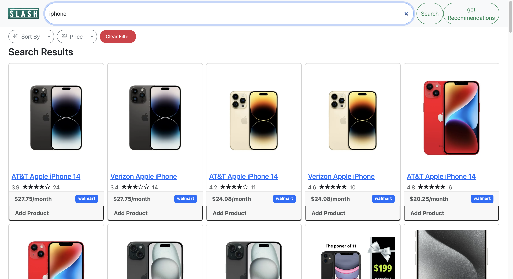
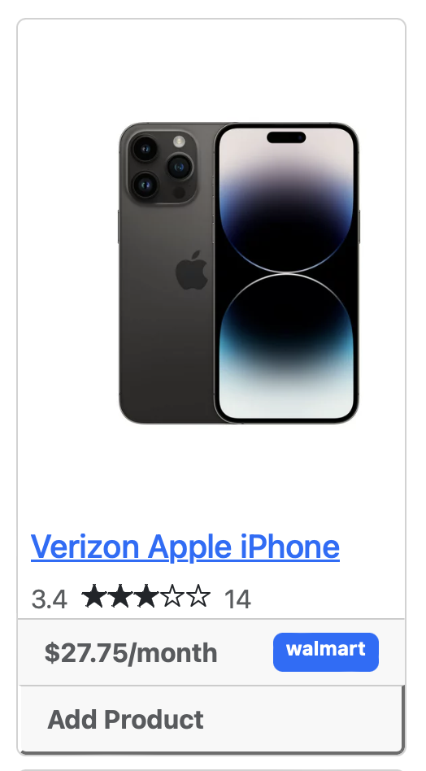
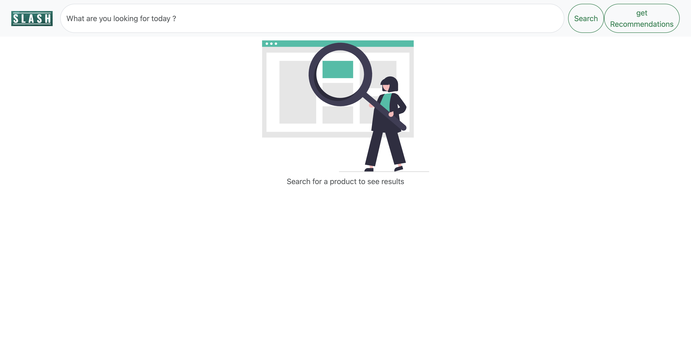
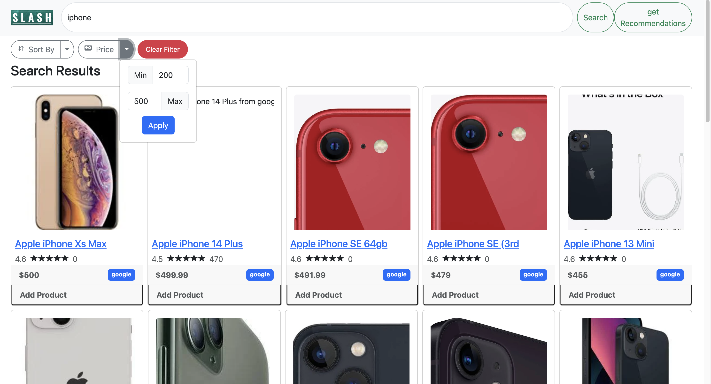
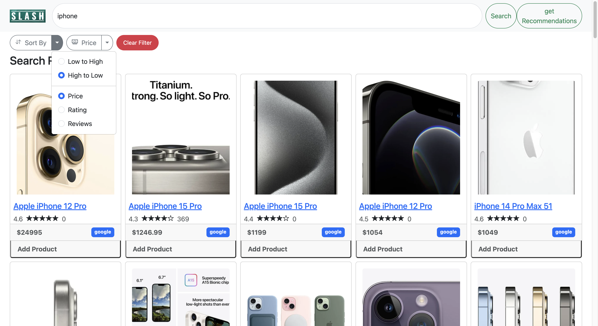
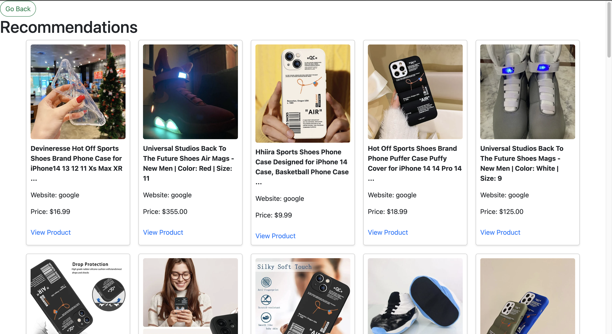

<p align="center"></p>
<p align="center"> <em><span style="font-size:larger;">Slash your shopping bills, not your style</span></em>

</p>

[](https://github.com/omjain2001/slash/blob/main/LICENSE)
[](https://zenodo.org/doi/10.5281/zenodo.10030696)

[](https://github.com/omjain2001/slash/issues)
[](https://github.com/omjain2001/slash/issues?q=is%3Aissue+is%3Aclosed)
[](https://github.com/omjain2001/slash/pulls?q=is%3Apr+is%3Aclosed)
[](https://github.com/omjain2001/slash/actions/workflows/pylint.yml)
[](https://github.com/omjain2001/slash/actions/workflows/pytest.yml)
[](https://github.com/omjain2001/slash/actions/workflows/python-package.yml)
[](https://github.com/omjain2001/slash/actions/workflows/style_checker.yml)


Slash is a tool that scrapes the most popular e-commerce websites to get the best deals on searched items across these websites.

- **Fast**: With slash, you can save over 50% of your time by comparing deals across websites within seconds
- **Easy**: Slash uses very easy commands to filter, sort and search your items
- **Powerful**: Quickly alter the commands to get desired results
<p align="center">
Checkout our newest Features! Mini Version and Full version now showcasing new sets of improvements.

# :movie_camera: Demo

[](https://www.youtube.com/watch?v=4jWzkKmwJTM)

# :exclamation: Needed Software

1. Python 3 (Version 3.9.7 or lower)
2. Pip
3. Flask

# :rocket: Installation

## :floppy_disk: Initial Steps

1. Access the Github repository from your computer.

- First, pre-install [git](https://git-scm.com/) on your machine.
- Then, clone the following repo:

```
https://github.com/omjain2001/slash.git
```

- Finally, `cd` into the local repository.

```
cd slash
```

2. Install the `requirements.txt`.

- This project uses Python 3, so make sure that [Python](https://www.python.org/downloads/) and [Pip](https://pip.pypa.io/en/stable/installation/) are preinstalled.
- Install the `requirements.txt` file using pip.

```
pip3 install -r requirements.txt
```

<p>

## :key: Using the UI Version

1. After completing the <a href="#floppy_disk-initial-steps">Initial Steps</a> and all project dependencies are installed.

2. Make sure you are in the base directory.
3. Use the `python -m flask run` command.

```
MAC
python3 -m flask --app src/app.py run

Windows
python -m flask --app src/app.py run
```

4. Once flask is running, open your internet browser and type `http://127.0.0.1:5000/` into the search bar.

# :dizzy: What's New in Phase 5

## :computer: Updated UI

1. Unveiled innovative components:
   - `Authentication` mechanism
   - Personalized `Profile` management
   - Streamlined `Favorites` feature
   - Incorporated `Personalized Recommendations` based on user preferences
2. Empowered users to curate a selection of preferred products within their `Favorites` for convenient future access.
3. Rectified issues pertaining to the responsiveness of the search bar, ensuring seamless user interaction.
4. Implemented an enhanced and more fluid dropdown interface, elevating the overall user experience.
5. Successfully addressed and resolved challenges associated with the `Filter` functionality, ensuring optimal performance.
6. Achieved comprehensive responsiveness across diverse screen dimensions, encompassing seamless usability on smartphones.
7. Introduced an advanced sorting capability, enabling users to refine product searches based on `Reviews` for a more tailored shopping experience.

<p align="center"></p>

## :camera: Scraping images

We successfully scraped images from websites. This can be displayed in the UI.

<p align="center"></p>

## :red_car: Created Diagram for Code Flow

Made a diagram to digest how the code flows for future contributors.

<p align="center"></p>

# :golf: How to use `Slash`

## Authentication

User will require to login/signup before moving to the dashboard. Enter your username and password to login in the application

## Search

There is a search bar that users will see after login. Simply type the desired item in the box.

<p align="center"></p>

## Sorting

You can sort by prices, ratings, and reviews using the dropdown below the search bar. The sort can be from high-to-low or low-to-high. Moreover, you can set the range of price using `Price` option.

<p align="center"></p>
<p align="center"></p>

## Grid of Items

There is a grid of items that shows all the products including name, ratings, price, store name, and an image of the item.

<p align="center"></p>

## :raising_hand_man: Profile

You can view and edit your profile details in the `Profile` tab.

## :heart: Favorites

You can mark desired product as a `Favorite` that can be accessed later.

## :robot: Personalized Recommendation

You can set your preferences and get a personalized list of products that caters to your preferences.

<p align="center"></p>

# :muscle: What's next for future development?

<p align="center"></p>

- Creating ordering and payment functionality for customers
- Take coupons or promo codes into consideration
- Provide parameters like in-store availability or inventory
- Increase the number of filters.
- Host on a docker container

## :thought_balloon: Use Case

- **_Students_**: Students coming to university are generally on a budget and time constraint and generally spend hours wasting time searching for products on Websites. Slash is the perfect tool for these students that slashes all the unnecessary details on a website and helps them get prices for a product across multiple websites. Make the most of this tool in the upcoming Black Friday Sale.
- **_Data Analysts_**: Finding data for any project is a tedious job for a data analyst, and the datasets found might not be the most recent one. Using slash, they can create their own dataset in real time and format it as per their needs so that they can focus on what is actually important. On top of this, finding data can be easily automated to suit the data analysts needs.

## :page_facing_up: Why

- In a market where we are spoilt for choices, we often look for the best deals.
- The ubiquity of internet access has leveled the retail playing field, making it easy for individuals and businesses to sell products without geographic limitation. In 2020, U.S. e-commerce sales, receiving a boost due to the COVID-19 pandemic, grew 44% and represented more than 21% of total retail sales, according to e-commerce information source Internet Retailer.
- The growth of e-commerce has not only changed the way customers shop, but also their expectations of how brands approach customer service, personalize communications, and provide customers choices.
- E-commerce market has prompted cutthroat competition amongst dealers, which is discernable through the price patterns for products of major market players. Price cuts are somewhat of a norm now and getting the best deal for your money can sometimes be a hassle (even while online shopping).
- This is what Slash aims to reduce by giving you an easy-to-use, all-in-one-place solution for finding the best deals for your products that major market dealers have to offer!
- Slash in its current form is for people who have some understanding of Python and are comfortable with using the command line interface to interact with systems.
- Future updates aim to encompass a wide variety of users irrespective of their computer knowledge and background.

# :bulb: Motivation

We saw potential in this as e-commerce is a very common tool that people use to buy online. Even so, it can be hard to find the best item based on ratings and prices. This usually requires several tabs for Amazon, Walmart, and other stores. With Slash, this can be made easy, which resonated with the group. We strived to add to this as we would like a fully functioning version of Slash in order to make shopping online easier.

# :sparkles: Contributors

- Sakshi Mahadik
- Jaiwin Shah
- Jay Shah
- Om Jain

## :email: Support

For any queries and help, please reach out to us at: omjain639@gmail.com
