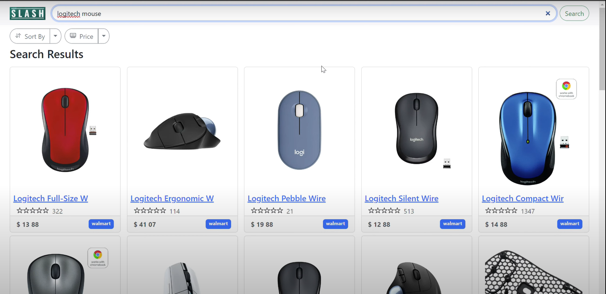
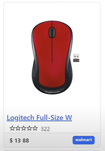
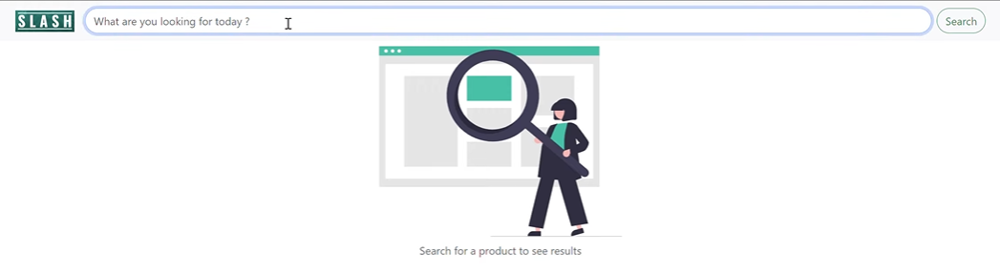

<p align="center"></p>

[](https://github.com/jashgopani/slash/blob/main/LICENSE)
[](https://doi.org/10.5281/zenodo.5739350)

[](https://github.com/jashgopani/slash/issues)
[](https://github.com/jashgopani/slash/issues?q=is%3Aissue+is%3Aclosed)
[](https://github.com/jashgopani/slash/pulls?q=is%3Apr+is%3Aclosed)
[](https://codecov.io/gh/jashgopani/slash)
[](https://github.com/jashgopani/slash/actions/workflows/pylint.yml)
[](https://github.com/jashgopani/slash/actions/workflows/style_checker.yml)

Slash is a tool that scrapes the most popular e-commerce websites to get the best deals on searched items across these websites. 
- **Fast**: With slash, you can save over 50% of your time by comparing deals across websites within seconds
- **Easy**: Slash uses very easy commands to filter, sort and search your items
- **Powerful**: Quickly alter the commands to get desired results
<p align="center">
Checkout our newest Features! Mini Version and Full version now showcasing new sets of improvements.

# :movie_camera: Demo

[](https://www.youtube.com/watch?v=4jWzkKmwJTM)

# :exclamation: Needed Software
1. Python 3 (Version 3.9.7 or lower)
2. Pip
3. Flask

# :rocket: Installation

## :floppy_disk: Initial Steps

1. Access the Github repository from your computer. 
 - First, pre-install [git](https://git-scm.com/) on  your machine. 
 - Then, clone the following repo:
 ```
 https://github.com/jashgopani/slash.git
 ```
 * Finally, ```cd``` into the local repository.
```
cd slash
```
2. Install the ```requirements.txt```. 
- This project uses Python 3, so make sure that [Python](https://www.python.org/downloads/) and [Pip](https://pip.pypa.io/en/stable/installation/) are preinstalled.
- Install the ```requirements.txt``` file using pip.
```
pip3 install -r requirements.txt
```
<p>

## :key: Using the UI Version

1. After completing the <a href="#floppy_disk-initial-steps">Initial Steps</a> and all project dependencies are installed. 

2. Make sure you are in the base directory. 
3. Use the ```python -m flask run``` command.
```
MAC
export FLASK_APP=src/modules/app
python3 -m flask run

Windows
set FLASK_APP=src\modules\app 
python -m flask run
```
4. Once flask is running, open your internet browser and type ```http://127.0.0.1:5000/``` into the search bar.

# :dizzy: What's New in Phase 4

## :computer: Updated UI

1. UI looks more polished
2. Added new components to the UI including:
   * Navbar
   * Filter bar
3. Fixed responsiveness bugs with the search bar
4. A smoother dropdown added to the UI
5. New layout where there is no table. Instead, it is a grid layout.
6. Responsive for any screen size, including smartphones.

<p align="center"></p>

## :camera: Scraping images

We successfully scraped images from websites. This can be displayed in the UI.

<p align="center"></p>

## :red_car: Created Diagram for Code Flow

Made a diagram to digest how the code flows for future contributors.

<p align="center"></p>

## 💿: Deprecated Feature

We removed the command line interface as the UI is easier for the average user.

# :golf: How to Use the UI 

## Search

There is a search bar that users will see when opening this application. Simply type the desired item in the box.

<p align="center"></p>

## Sorting

You can sort by ratings or prices using the dropdown below the search bar.

<p align="center"></p>

## Grid of Items

There is a grid of items that shows all the items including name, ratings, price, store name, and an image of the item.

<p align="center"></p>

# :muscle: What's next for future development?

<p align="center"></p>

- Creating ordering and payment functionality for customers to directly order from command line
- Take coupons or promo codes into consideration
- Provide parameters like in-store availability or inventory
- Increase the number of filters.
- Add login for the web version.
- Host on a docker container


:thought_balloon: Use Case
---
* ***Students***: Students coming to university are generally on a budget and time constraint and generally spend hours wasting time searching for products on Websites. Slash is the perfect tool for these students that slashes all the unnecessary details on a website and helps them get prices for a product across multiple websites. Make the most of this tool in the upcoming Black Friday Sale.
* ***Data Analysts***: Finding data for any project is a tedious job for a data analyst, and the datasets found might not be the most recent one. Using slash, they can create their own dataset in real time and format it as per their needs so that they can focus on what is actually important. On top of this, finding data can be easily automated to suit the data analysts needs.

:page_facing_up: Why
---
- In a market where we are spoilt for choices, we often look for the best deals.  
- The ubiquity of internet access has leveled the retail playing field, making it easy for individuals and businesses to sell products without geographic limitation. In 2020, U.S. e-commerce sales, receiving a boost due to the COVID-19 pandemic, grew 44% and represented more than 21% of total retail sales, according to e-commerce information source Internet Retailer.
- The growth of e-commerce has not only changed the way customers shop, but also their expectations of how brands approach customer service, personalize communications, and provide customers choices.
- E-commerce market has prompted cutthroat competition amongst dealers, which is discernable through the price patterns for products of major market players. Price cuts are somewhat of a norm now and getting the best deal for your money can sometimes be a hassle (even while online shopping).
- This is what Slash aims to reduce by giving you an easy-to-use, all-in-one-place solution for finding the best deals for your products that major market dealers have to offer!
- Slash in its current form is for people who have some understanding of Python and are comfortable with using the command line interface to interact with systems.
- Future updates aim to encompass a wide variety of users irrespective of their computer knowledge and background.

# :bulb: Motivation
We saw potential in this as e-commerce is a very common tool that people use to buy online. Even so, it can be hard to find the best item based on ratings and prices. This usually requires several tabs for Amazon, Walmart, and other stores. With Slash, this can be made easy, which resonated with the group. We strived to add to this as we would like a fully functioning version of Slash in order to make shopping online easier. 

# :sparkles: Contributors

- Akhilesh Neeruganti
- Jash Gopani
- Rohan Ajmera
- Hemil Mehta

## :email: Support

For any queries and help, please reach out to us at: neerua08@gmail.com
